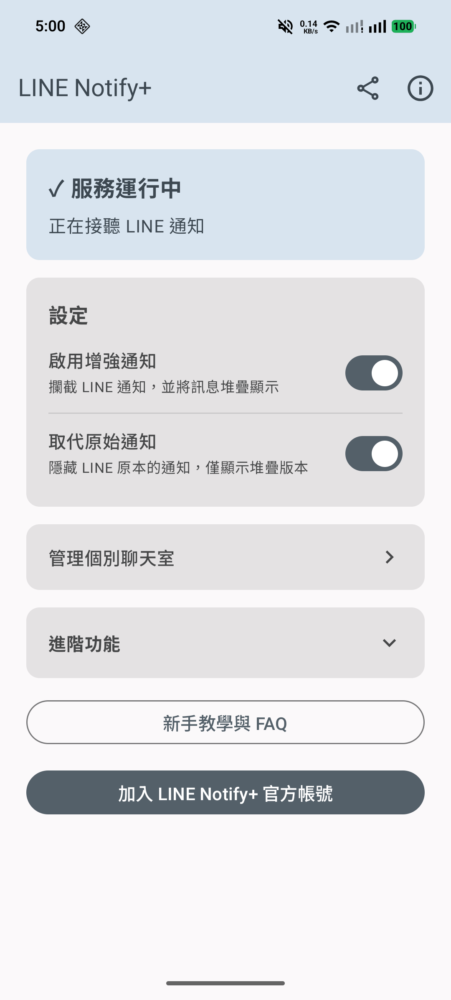
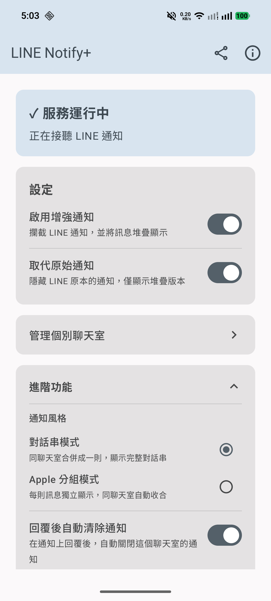
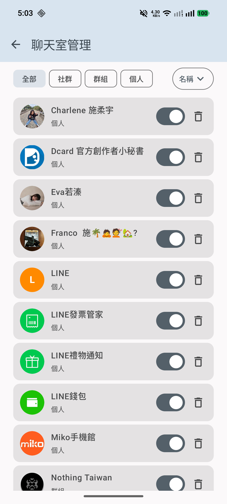
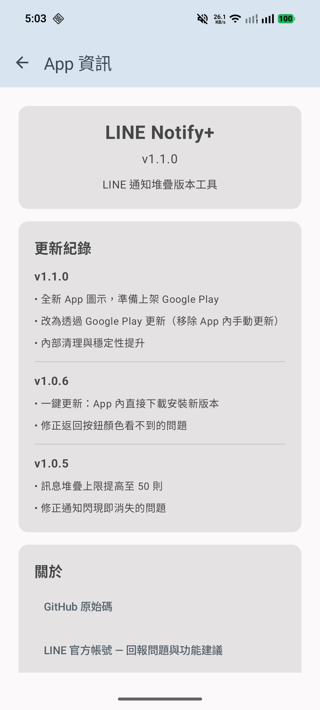
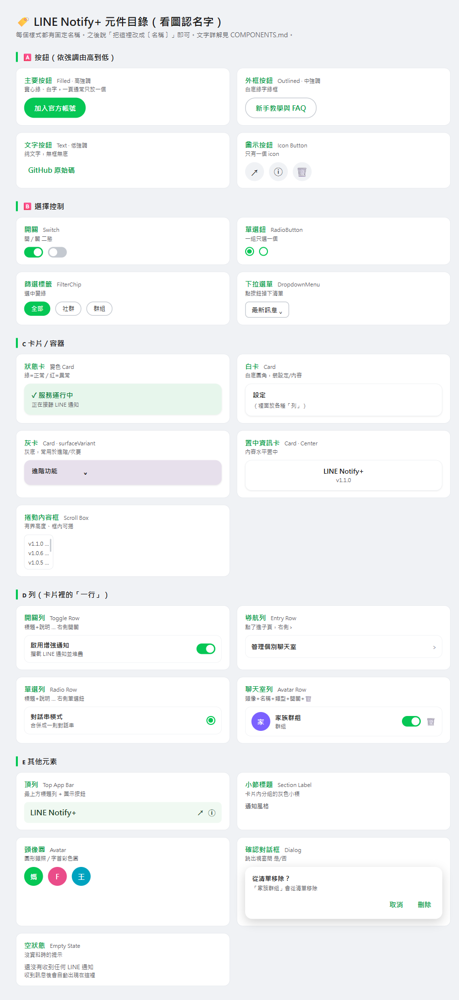

# LINE Notify+ — 設計樣式目錄（Component Catalog）

> **目的**：給每個 UI 樣式一個固定**名稱**。之後你只要說「把這裡改成〔名稱〕」我就懂，不用再一直描述。
> 「目前用在」那欄可以對照你手機截圖辨認。

## ⚠️ 先講配色：App 用「動態取色」(Material You)

目前 `Theme.kt` 設 `dynamicColor = true`，**主色（強調色）會跟著使用者手機桌布自動變**：
- **你這台手機 → 主色是「藍灰」**（開關、選中的 chip、選中的單選鈕、官方帳號按鈕都是藍灰，不是綠）
- 別台桌布不同 → 可能變藍 / 粉 / 綠…
- **固定不變的**：卡片底色（淺灰）、文字（深色）。**只有主色會動。**

> 下面表格裡寫的「綠」＝指「**主色**」。在你這台手機上，主色實際是**藍灰**。
>
> **✅ 已決定（2026-06）：採「混合」配色** —— **主要按鈕 / 關鍵強調色鎖定品牌綠**；其餘次要元素（開關、chip…）跟隨系統動態取色。會在 UI 建置階段套用到 `Theme.kt`。

## 🖼️ 視覺版

### 📱 實機真實畫面（這台 = 藍灰主色）

**主畫面**（由上而下）：① 頂列　② 狀態卡　③ 白卡「設定」(內含 開關列×2)　④ 導航列　⑤ 灰卡「進階功能」　⑥ 外框按鈕　⑦ 主要按鈕

**進階功能展開**：小節標題(通知風格) → 單選列(對話串 / Apple) → 開關列(清除時機)

**聊天室頁**：篩選標籤(全部/社群/群組/個人) ＋ 排序下拉　|　聊天室列(含**真實頭像圈**)

**關於頁**：置中資訊卡　|　捲動內容框(更新紀錄)　|　文字按鈕(GitHub / 官方帳號)

### 🎨 對照組：若改用「固定品牌綠」會長這樣
（下圖是我用品牌綠畫的版本，給你比對「鎖定綠色」的效果）

---

## 🅰️ 按鈕類（依「強調程度」由高到低）

> Material Design 把按鈕分成幾個強調等級：**越實心越搶眼**。同一頁通常只放一個「主要按鈕」。

| 名稱 | 長相 | 類型 | 製作方式 | 目前用在 |
|---|---|---|---|---|
| **主要按鈕** | 實心綠底、白字、滿寬圓角 | Filled（高強調） | `Button(...)` | 加入官方帳號、開啟通知存取權 |
| **外框按鈕** | 白底、綠字、綠細框、滿寬圓角 | Outlined（中強調） | `OutlinedButton(...)` | 新手教學與 FAQ、語言/排序下拉外殼 |
| **文字按鈕** | 純文字、無框無底 | Text（低強調） | `TextButton(...)` | GitHub 原始碼、對話框的 取消/刪除 |
| **圖示按鈕** | 只有一個 icon | Icon Button | `IconButton { Icon(...) }` | 頂列 分享↗️/資訊ⓘ、聊天室列 🗑️ |

## 🅱️ 選擇控制類

| 名稱 | 長相 | 類型 | 製作方式 | 目前用在 |
|---|---|---|---|---|
| **開關** | 綠/灰 滑動鈕（開或關） | Switch | `Switch(...)` | 啟用增強通知、取代原始通知、清除時機、聊天室開關 |
| **單選鈕** | 圓形點選（一組只選一個） | RadioButton | `RadioButton(...)` | 通知風格 對話串/Apple |
| **篩選標籤** | 膠囊標籤，選中變綠 | FilterChip | `FilterChip(...)` | 聊天室分類 全部/社群/群組/個人 |
| **下拉選單** | 點按鈕 → 掉下選項清單 | DropdownMenu | `OutlinedButton + DropdownMenu` | 語言、排序 |

## 🇨 容器 / 卡片類

| 名稱 | 長相 | 類型 | 製作方式 | 目前用在 |
|---|---|---|---|---|
| **狀態卡** | 變色卡（綠=正常 / 紅=異常），粗標題+說明 | 變色 Card | `Card(colors=...)` | 首頁 服務狀態 |
| **白卡** | 白底圓角卡，裝設定或內容 | Card | `Card { Column {…} }` | 設定卡、說明卡、FAQ 卡 |
| **灰卡** | 灰底圓角卡 | Card（surfaceVariant） | `Card(colors=surfaceVariant)` | 進階功能（可摺疊） |
| **置中資訊卡** | 內容水平置中 | Card | `Card { Column(Center) }` | 關於頁 App 名稱/版本 |
| **捲動內容框** | 有界高度、框內可捲（不必整頁滑） | 內嵌 scroll | `Column(heightIn(max).verticalScroll())` | 關於頁 更新紀錄 |

## 🇩 列（Row）類 — 卡片裡的「一行」

| 名稱 | 長相 | 製作方式 | 目前用在 |
|---|---|---|---|
| **開關列** | 標題+說明 ……… 右側 開關 | `Row { Column{標題,說明}; Switch }` | 設定裡每個開關 |
| **導航列** | 文字 ……… 右側 ›（點了進子頁） | `Card.clickable { Row{ 文字; › } }` | 管理個別聊天室 |
| **單選列** | 標題+說明 ……… 右側 單選鈕 | `Row { Column; RadioButton }` | 通知風格選項 |
| **聊天室列** | 頭像 + 名稱+類型 … 開關 🗑️ | `Card { Row{ 頭像; Column; Switch; IconButton } }` | 聊天室管理清單 |

## 🇪 其他元素

| 名稱 | 長相 | 製作方式 | 目前用在 |
|---|---|---|---|
| **頂列** | 最上方標題列（淺綠底）+ 右側圖示按鈕 | TopAppBar | 每頁最上面 |
| **小節標題** | 灰色小字標題（分組用） | `Text(14sp, onSurfaceVariant)` | 設定裡「通知風格」「語言」 |
| **頭像圈** | 圓形頭照 / 字首彩色圈（沒頭照時） | `Image.clip(CircleShape)` 或 `Box(圓){首字}` | 聊天室列 |
| **確認對話框** | 跳出視窗問 是/否 | AlertDialog | 刪除聊天室確認 |
| **空狀態** | 沒資料時的提示文字 | `Column { Text… }` | 聊天室清單為空時 |

---

## 怎麼用這份目錄溝通（範例）

- 「把『官方帳號』從 **主要按鈕** 改成 **外框按鈕**」
- 「『管理個別聊天室』我想從 **導航列** 改成一張 **白卡**，裡面放兩個 **導航列**」
- 「語言不要 **下拉選單**，改成 **單選列**」
- 「首頁最上面加一張 **狀態卡**，下面接 **白卡**」

> 想新增目前沒有的樣式（例如卡片式大按鈕、分段控制 SegmentedButton、底部導航 Tabs…）也可以，跟我說，我做出來後就幫它取個名字加進這份目錄。
