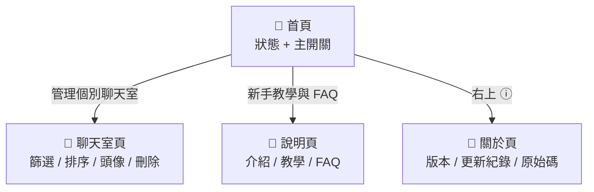

# LINE Notify+ — App 結構草稿（v0，給你改）

> **填法**：直接在這份上 改 / 加 / 刪 / 註記。
> 每頁用**樹狀圖**呈現（由上而下＝畫面從上到下的排列）。元件名稱見 `COMPONENTS.md`（含視覺版）。
> 標 **✏️** 的地方是等你決定的。下面是「現況」，請改成你心目中的樣子。

---

## 0. 一句話定位
現況：把 LINE 通知堆疊重組、可在通知上快速回覆的「通知增強工具」。
✏️ 你的版本：＿＿＿＿＿＿

---

## 1. 功能清單（勾你要的、加你想加的）

**背景引擎（使用者不直接操作）**
- [x] 攔截 LINE 通知重組　- [x] 對話串 / Apple 兩種風格　- [x] 快速回覆（含本人頭貼）
- [x] 點擊跳轉　- [x] 雙開區分　- [x] 通話守門　- [x] 取代原通知　- [x] 回覆/已讀後清除

**使用者會操作的**
- [x] 服務狀態　- [x] 主開關（啟用增強通知）　- [x] 取代原始通知
- [x] 通知風格 / 清除時機 / 語言　- [x] 管理個別聊天室（開關/頭像/分類/排序/刪除）
- [x] 新手教學 / FAQ / 關於 / 官方帳號 / 分享

**想加但還沒做（✏️ 勾你要的）**
- [ ] 問題回報　- [ ] 功能許願池　- [ ] 收回訊息保留　- [ ] 訊息搜尋
- [ ] 自訂通知音效/震動　- [ ] Widget　- [ ] 通知 icon 風格自選　- [ ] ✏️ 其他：＿＿＿

---

## 2. 導航模型（✏️ 三選一）
- [ ] **A 單頁捲動**　- [ ] **B 首頁 + 推送子頁**　- [ ] **C 底部 Tabs**
✏️ 你選：＿C＿＿　　原因：＿感覺如果功能一多起來，底部tabs比較適合；不過我們要怎麼設計才能夠簡約，好看，使用者友善呢?＿＿

---

## 3. 導航地圖（哪些頁、怎麼互通）— Mermaid 圖表

> 下面是 Mermaid（純文字）。貼進 GitHub / VS Code / Obsidian 會自動渲染成流程圖。
> 渲染後的樣子見 `nav-diagram.png`。



✏️ 你想新增/改的頁面與跳轉：＿＿＿

---

## 4. 各頁結構（樹狀＝由上而下的畫面排列）

### 📱 首頁
```
📱 首頁
├─ 頂列：「LINE Notify+」 ＋ 圖示按鈕(分享↗) ＋ 圖示按鈕(資訊ⓘ)
├─ 狀態卡：✓ 服務運行中 / 正在接聽 LINE 通知
├─ 白卡「設定」
│   ├─ 開關列：啟用增強通知           [開關]
│   └─ 開關列：取代原始通知           [開關]
├─ 導航列：管理個別聊天室  ›    ───────▶ 聊天室頁
├─ 灰卡「進階功能」（可摺疊）
│   ├─ 單選列：通知風格（對話串 / Apple）
│   ├─ 開關列：回覆後清除            [開關]
│   ├─ 開關列：已讀後清除            [開關]
│   └─ 下拉選單：語言
├─ 外框按鈕：新手教學與 FAQ    ───────▶ 說明頁
└─ 主要按鈕：加入官方帳號
```
✏️ 想怎麼改：＿管理個別聊天室我想要像之前一樣用外匡按鈕，頂列的LINE Notify+ 她的左側要跟下面的卡的左側對齊 然後再它的右變放一個我們的icon logo。進階功能的部分：

1. 已讀後自動清除通知
   這部分應該是一直都要開啟的，所以我們不用保留這個選項，直接把它拿掉。反正現在已讀後都會自動清除通知，應該沒有人會想要關閉這個功能。

2. 回覆後自動清除通知
   (a) 名稱建議改成「回覆後清除通知」。
   (b) 下方說明文字：在通知上回覆後過一秒，該則通知就會被清除，不再顯現。畢竟我們不是要關閉這個聊天室這一陣子的通知，而只是把那一則你已經回覆過的通知給清除掉。
   (c) 這裡可以放一個小小的「i」圖示，點擊之後會出現一個 GIF 來演示實際效果。通知風格、對話串模式跟 Apple 分組模式，也都會有一個 GIF 來展現它們的效果是怎麼樣

### 📱 聊天室頁
```
📱 聊天室頁
├─ 頂列：← 返回 ＋「聊天室管理」
├─ 篩選/排序列（同一行）
│   ├─ 篩選標籤：全部 / 社群 / 群組 / 個人
│   └─ 下拉選單：排序（最新訊息 / 名稱）   ← 靠右
└─ 聊天室列 × N
    └─ 頭像圈 ＋ 名稱 ＋ 類型 ＋ 開關 ＋ 圖示按鈕(🗑️)
```
✏️ 想怎麼改：首先可以在右上角的地方加一個 Information 按鈕，點擊的時候會跳出一個小的 Pop-up 說明，解釋這裡的功能，它會解釋「聊天室管理」的功能，以及 switch on / off 會產生什麼作用。

如果想要同時控制一堆人的開關，長按聊天室就會進入選取模式，可以一次性調整多人的狀態。長按後，上方也會出現「全選」或「取消全選」的按鈕。

關於這個 pop-up 的說明，其中一行文字會有一個小超連結。點開後會額外說明：我們並不會收集您的聊天室資料，只有在訊息傳入時，才會抓取該聊天室的名稱與頭像。因此，這些資料都是在本地端抓取通知訊息而已。

此外，該說明也會提到：
1. 只有出現訊息的人才會出現在這個列表。
2. 如果對方的頭像沒正確顯示，或沒出現該聊天室選項，可能是因為通知還沒出現，或是訊息尚未被抓取到。

聊天室當然也有搜尋功能，她的放大鏡會再information 按鈕的左邊。目前的排列順序應該是：全部好友、群組、社群。

不過目前發現一個狀況：系統現在似乎無法正確抓取到「社群」，會把社群都歸類在「群組」裡面。

如果針對特定的聊天室不需要這個功能，也可以把它關掉。

另外，我覺得我們可以一起來思考一下，這個刪除功能的用意是什麼呢？刪除之後，如果這個人之後還有訊息的話，也還是會出現。＿＿＿

### 📱 說明頁
```
📱 說明頁
├─ 頂列：← 返回 ＋「說明與 FAQ」
├─ 白卡：App 介紹
├─ 白卡：新手教學（4 步）
├─ 白卡：通知風格說明
└─ 白卡：FAQ
```
✏️ 想怎麼改：＿首先我們需要統一名稱，目前一下叫「新手教學與 FAQ」，一下又叫「說明與 FAQ」，這部分想跟您討論一下。

關於新手教學，我們需要檢視 APP 剛下載時的 onboarding 流程是否夠順利：

1. 說明 LINE Notify 的功能
   底下的解釋可以講得詳細一點，說明它會讀取 LINE 的原始通知，並將訊息進行堆疊。這樣使用者就能一直收到通知，並看完完整聊天室的所有新訊息，而不像原本 LINE 只能顯示最新的一條。請用這個脈絡去優化講法。

2. 通知風格說明
   這一塊可以不用做，因為我們在外部的「進階設定」那邊已經有說明瞭。

關於 FAQ 的部分：
1. 呈現方式
   就像一般的 FAQ，設計成可以展開的形式即可，不需要一次全部顯示出來。

2. 內容參考
   可以參考手機上另一個 APP「LINE Notification Enhancer」的 FAQ 問與答頁面，裡面有提到關於其他手機設定的處理方式。＿＿

### 📱 關於頁
```
📱 關於頁
├─ 頂列：← 返回 ＋「App 資訊」
├─ 置中資訊卡：App 名稱 ＋ 版本 ＋ 標語
├─ 捲動內容框：更新紀錄
└─ 白卡「關於」
    ├─ 文字按鈕：GitHub 原始碼
    └─ 文字按鈕：官方帳號
```
✏️ 想怎麼改：＿更新紀錄那邊 她的背景底 不要是灰色的＿＿

### 📱（✏️ 新頁面？）
```
✏️ 若要走 Tabs 或加新功能頁（搜尋 / 許願池…），照上面格式畫出來：

📱 ＿＿＿頁
├─ ＿＿＿
└─ ＿＿＿
```

---

## 5. 操作路徑（access：怎麼點到特定功能）
現況範例：
- 改通知風格 → 首頁 → 點開「進階功能」灰卡 → 單選列
- 關掉某聊天室 → 首頁 → 導航列「管理個別聊天室」 → 該列的開關

✏️ 你在意的路徑：＿＿＿
